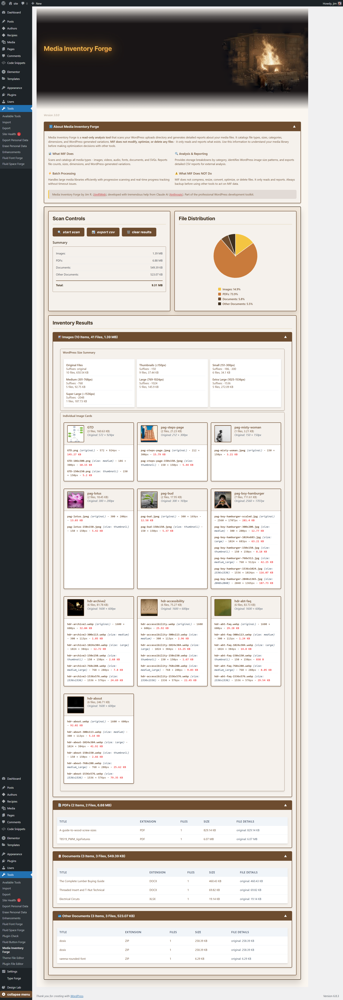

# Media Inventory Forge - WordPress Plugin


**Professional responsive design tools for WordPress developers**


[](https://wordpress.org/)
[](https://github.com/Mij-Strebor/media-inventory-forge/releases)
[](https://wordpress.org/)
[](LICENSE)
[](https://php.net/)

> **Professional WordPress Media Library Analysis Plugin**
> 
> Read-only media library scanner and analyzer for WordPress developers, agencies, and site administrators. Provides detailed inventory reports, storage breakdowns, and comprehensive data for planning optimization strategies.



---

## Why Media Inventory Forge?

Every WordPress site accumulates media files over time, but understanding what you have, where storage is being consumed, and which files may need attention becomes nearly impossible without proper analysis tools. Media Inventory Forge provides comprehensive inventory and reporting of your entire media library with detailed visualizations and exportable data.

**Important:** MIF is a read-only analysis tool. It scans and reports on your media files but does not modify, optimize, compress, resize, or delete any files. Always maintain backups before using other tools to act on MIF data.

### Perfect For
- **WordPress Developers** conducting detailed media audits for client sites
- **Agency Teams** managing multiple WordPress installations efficiently
- **Site Administrators** analyzing storage usage and planning cleanup strategies
- **Performance Specialists** gathering data to identify optimization opportunities
- **WordPress Professionals** needing comprehensive media library documentation

---

## Quick Start

⚠️ **Important for v2.x Users Upgrading to v3.0+:**
If you're upgrading from Media Inventory Forge v2.1.0 or earlier, please follow these steps:
1. **Deactivate** the old Media Inventory plugin (v2.x)
2. **Delete** the old plugin from your WordPress installation
3. **Install** the new Media Inventory Forge v3.0.0+
4. **Activate** the new version
   
  **Note:** Due to plugin slug changes between v2.x and v3.0+, WordPress will not automatically replace the old version. Following these steps prevents having duplicate menu entries.
  
  **Fresh Installation:**- Download from [Releases](https://github.com/Mij-Strebor/media-inventory-forge/releases)- Upload via WordPress Admin or extract to `/wp-content/plugins/`- Activate through WordPress admin

### 2. Access Plugin
Navigate to: **Tools → Media Inventory** in your WordPress admin menu sidebar

### 3. Run First Scan
```
Default Settings:
✅ Batch Size: 10 files per request
✅ Timeout: 30 seconds per batch  
✅ Categories: All media types
✅ Progress: Real-time tracking
```

### 4. Analyze Results
- **Storage Summary** with category breakdowns
- **WordPress Size Analysis** (thumbnails, medium, large)
- **CSV exports** for external analysis

---

## Key Features

### Comprehensive Inventory
- **File Categorization**: Images, SVG, Fonts, Videos, Audio, Documents, PDFs
- **Storage Reporting**: Total usage by category with detailed file counts
- **WordPress Size Analysis**: Detailed breakdown of thumbnail, medium, large sizes
- **File Details**: Dimensions, formats, and generated variations

### Professional Interface
- **Progressive Scanning**: Handles thousands of files with batch processing
- **Live Thumbnails**: Visual previews with hover effects
- **Memory Optimized**: Intelligent resource management
- **Error Handling**: Graceful handling of missing/corrupted files
- **Real-time Progress**: Visual progress bars with statistics

### Enterprise Architecture
- **Object-Oriented Design**: Modular class structure for maintainability
- **WordPress Standards**: Proper hooks, nonces, sanitization, security
- **Performance Optimized**: Memory and timeout management
- **Extensible Framework**: Clean architecture for future enhancements

---

## Using MIF Data for Optimization Planning

Media Inventory Forge provides the data foundation for optimization decisions. Here's how the insights can inform your strategy:

| What MIF Reports | How to Use This Data |
|------------------|----------------------|
| Original vs. generated sizes | Identify candidates for format conversion (WEBP, AVIF) |
| Large uncompressed files | Plan compression workflows with other tools |
| WordPress size distribution | Decide which thumbnail sizes to keep or remove |
| Format distribution | Identify legacy formats needing modernization |

*Note: Use MIF data with separate optimization tools. MIF only reports - it does not perform optimizations.*

### WordPress Size Categories
```
Example WordPress Image Size Distribution:
├── Thumbnails (≤150px): 245 files = 1.8 MB
├── Small (151-300px): 89 files = 3.2 MB
├── Medium (301-768px): 156 files = 12.4 MB
├── Large (769-1024px): 67 files = 8.9 MB
├── Extra Large (1025-1536px): 34 files = 15.2 MB
└── Super Large (>1536px): 23 files = 45.6 MB
```

---

## Technical Architecture

### Plugin Structure
```
media-inventory-forge/
├── media-inventory-forge.php      # Main plugin file
├── includes/
│   ├── core/                      # Core business logic
│   │   ├── class-scanner.php      # Batch processing engine
│   │   └── class-file-processor.php # Individual file analysis
│   ├── utilities/                 # Helper classes
│   │   └── class-file-utils.php   # File system utilities
│   └── admin/                     # Admin interface
│       └── class-admin.php        # Asset management
├── assets/                        # CSS/JS assets
│   ├── css/admin.css              # Professional styling
│   └── js/admin.js                # Interactive functionality
└── templates/                     # Template system
    └── admin/                     # Admin page templates
```

### Core Classes

- **`MIF_Scanner`**: Batch processing with memory management
- **`MIF_File_Processor`**: Individual file analysis and WordPress integration  
- **`MIF_File_Utils`**: File system utilities and security validation
- **`MIF_Admin`**: Professional asset management and enqueueing

---

## Performance Specifications

- **Batch Size**: 10 files per request (configurable)
- **Memory Usage**: Optimized for shared hosting
- **Timeout Handling**: 30-second limits with monitoring
- **File Support**: All WordPress media types
- **Scalability**: Tested with 10,000+ file libraries

---

## Development

### Requirements
- **WordPress**: 5.0+
- **PHP**: 7.4+
- **Development Environment**: Local by Flywheel recommended

### Setup for Contributions
```bash
# Clone repository
git clone https://github.com/Mij-Strebor/media-inventory-forge.git
cd media-inventory-forge

# Create feature branch
git checkout -b feature/your-feature-name

# Make changes, test, commit
git commit -m "Add: Your feature description"

# Push and create pull request
git push origin feature/your-feature-name
```

### Development Workflow
This plugin uses a professional development setup with symbolic links:

```bash
# Create symbolic link (Windows - run as Administrator)
mklink /D "[WordPress-Path]\plugins\media-inventory-forge" "[Git-Repo-Path]"

# Create symbolic link (Mac/Linux)  
ln -s /path/to/git/repo /path/to/wordpress/wp-content/plugins/media-inventory-forge
```

**Benefits**:
- Edit in your preferred location with git integration
- WordPress sees changes instantly
- Professional development workflow

---

## Use Cases & Examples

### Media Audit Documentation
```
Media Inventory Report - Example Site
═══════════════════════════════════════════

Library Overview:
   • Total Files: 1,247 media items
   • Storage Used: 127.4 MB  
   • Categories: 7 types identified
   • WordPress Sizes: 6 categories analyzed

Storage Distribution:
   • Images: 89.3 MB (70%)
   • Documents: 24.1 MB (19%)
   • Videos: 12.8 MB (10%)
   • Other: 1.2 MB (1%)

Image File Analysis:
   • Large originals (>1MB): 23 files
   • PNG format: 156 files
   • Generated thumbnails: 892 files
```

### Data for Planning
```
What MIF Reveals About Your Library
════════════════════════════════════

File Distribution:
   • Large Images (>1MB): 23 files = 45.6 MB
   • PNG Files: 156 files = 34.2 MB
   • WordPress Thumbnails: 892 files = 28.4 MB

Potential Optimization Opportunities:
   • Review 23 large originals for resize candidates
   • Consider compression for 156 PNG files
   • Evaluate if all thumbnail sizes are needed

*Use this data with compression and optimization tools*
```

---

## Version History

### Version 3.0.0 (Latest)
**Forge Header & File Distribution Release**
- **Forge Header System**: Dramatic multi-directional gradient with seamless integration
- **File Distribution Pie Chart**: Interactive canvas-based visualization with color-coded legend
- **Design System**: Inter font family, enhanced color palette, 1280px alignment
- **UI/UX Polish**: Fixed border-radius, scoped CSS, optimized spacing
- **Performance**: Modular CSS organization, clean asset structure

### Version 2.1.1
**WordPress.org Compliance Release**
- Added Update URI for GitHub update support
- Created uninstall.php handler
- Enhanced CSV export security documentation
- Fixed version consistency across files

### Version 2.1.0
**Documentation & Code Quality Release**
- **Complete Documentation**: Comprehensive JSDoc/PHPDoc for all classes and methods
- **Code Organization**: Structured sections with clear headers across all files
- **UI Consistency**: All category sections now collapsible with toggle functionality
- **Code Cleanup**: Removed redundant logic and dead code (~30 lines)
- **Enhanced Maintainability**: Improved file organization for easier navigation

### Version 2.0.0
**Major Architecture Overhaul**
- **Plugin Conversion**: Code snippet → Professional WordPress plugin
- **Object-Oriented Architecture**: Modular class structure
- **Enhanced Performance**: Improved memory management
- **WordPress Standards**: Complete compliance
- **Professional Workflow**: Git integration and symbolic links

### Version 1.0.0 (Legacy)
- Initial code snippet release
- Basic scanning functionality
- CSV export capabilities
---

## Contributing

We welcome contributions! Here's how:

### Bug Reports & Feature Requests
- **Issues**: [Report bugs or request features](https://github.com/Mij-Strebor/media-inventory-forge/issues)
- **Discussions**: [General questions and ideas](https://github.com/Mij-Strebor/media-inventory-forge/discussions)

### Development Contributions
1. **Fork** the repository
2. **Create feature branch**: `git checkout -b feature/amazing-feature`
3. **Follow WordPress coding standards**
4. **Test thoroughly** on different WordPress versions
5. **Commit with clear messages**: `git commit -m 'Add: Amazing feature'`
6. **Push to branch**: `git push origin feature/amazing-feature`
7. **Open Pull Request** with detailed description

### Development Guidelines
- Follow [WordPress Coding Standards](https://developer.wordpress.org/coding-standards/)
- Include comprehensive testing for new features
- Update documentation for any user-facing changes
- Ensure backward compatibility when possible

---

## License

**GPL v2 or later** - [License Details](LICENSE)

**Why GPL v2+?**
- WordPress compatibility and community standards
- Encourages open source development and contributions
- Compatible with WordPress.org submission requirements

---

## Acknowledgments

- **[Jim R.](https://jimrweb.com)** - Original concept, development, and JimRWeb design system
- **[Claude AI](https://anthropic.com)** - Development assistance and architecture guidance
- **WordPress Community** - Inspiration, best practices, and coding standards
- **Contributors** - Everyone who helps improve this plugin

---

## Support & Professional Services

### Community Support
- **GitHub Issues**: Bug reports and feature requests
- **GitHub Discussions**: Community Q&A and general discussion

### Professional Services
For custom WordPress development, consulting, or plugin customization services, visit [JimRWeb.com](https://jimrweb.com)

---


</div>


<div align="center">

**🚀 Made with ❤️ for the WordPress Community**

[⭐ Star this repository](https://github.com/Mij-Strebor/media-inventory-forge) • [🐛 Report Issues](https://github.com/Mij-Strebor/media-inventory-forge/issues) • [💬 Join Discussion](https://github.com/Mij-Strebor/media-inventory-forge/discussions)

**Professional WordPress Plugin Development** | **[JimRWeb.com](https://jimrweb.com)**

</div>
